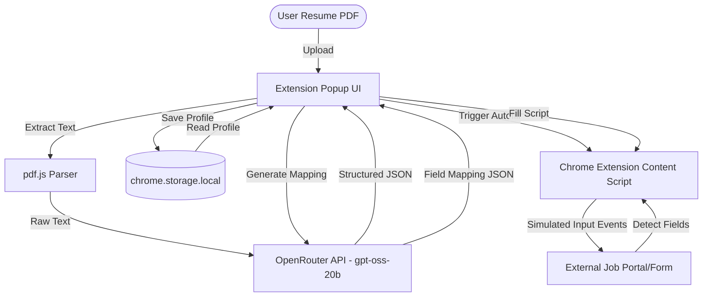

# ApplyOnce AI — Enterprise-Grade Universal Application Autofill Engine

[](https://nodejs.org/)
[](https://developer.chrome.com/docs/extensions/)
[](https://openrouter.ai/)
[](https://applyonce-ai-pitchdesk.vercel.app/)

**Live Pitch Deck:** [ApplyOnce AI Pitch Deck](https://applyonce-ai-pitchdesk.vercel.app/)

ApplyOnce AI is a secure, privacy-first universal profile parsing and browser form-filling automation engine. The platform combines dynamic in-browser PDF parsing with LLM semantic extraction to construct structure-validated candidate profiles, enabling seamless autofill workflows across any online application portal.

---

##  The Problem We Solve

Job seekers spend hours manually typing the same repetitive information into job application portals (Workable, Greenhouse, Lever, Ashby, BambooHR, etc.). Rigid legacy autofill tools rely on brittle element ID matching, resulting in incomplete fields, broken UI mappings, and leaked data. 

**ApplyOnce AI resolves this by:**
1. **Document-to-Profile Parsing**: Parsing raw PDF resumes locally using `pdf.js` and structure-extracting candidate data semantically.
2. **Context-Aware Semantic Autofill**: Translating page-level inputs, dropdowns, textareas, checkboxes, and radio buttons into a structured API mapping using OpenRouter's `openai/gpt-oss-20b:free` model.
3. **Controlled Event Dispatching**: Triggering programmatic DOM inputs (`input`, `change`, `blur`) directly on the webpage, ensuring form state updates synchronize correctly with modern UI frameworks like React, Angular, and Vue.

---

##  Architectural Overview

ApplyOnce AI uses a decentralized, local-first storage design. Sensitive candidate credentials and resumes are processed in-browser. Staged profile details are retained exclusively within the client container (`chrome.storage.local`), ensuring zero server-side persistence of personal data.



---

##  Key Features

- **LLM-Powered Document Semantic Extraction**: Eliminates rigid resume templates. Upload PDF CVs, execute local PDF text extraction via Web Workers, and compile structured profiles via OpenRouter AI.
- **Dynamic Field Mapping Engine**: Maps forms dynamically on any domain using label-matching, semantic pattern groupings, and aria attribute checks.
- **Form Event Simulation**: Simulates user keystrokes and change events natively in the DOM, guaranteeing compliance with modern framework-controlled fields.
- **Export & Import Engine**: Back up your locally stored profile data as standard JSON and restore it at any time directly through the Settings dashboard.
- **No-Backend Storage Architecture**: Eliminates privacy risks. All credentials stay directly within Chrome's sandbox-isolated storage.

---

##  Repository Structure

```
applyonce-ai/
├── extension/                  # Chrome Extension Container
│   ├── manifest.json           # Extension Metadata & Permissions (Manifest V3)
│   ├── popup.html              # Extension Popup View Entry
│   ├── options.html            # Extension Settings View Entry
│   ├── src/
│   │   ├── background/         # Extension Service Worker (Lifecycle & Message Routing)
│   │   ├── content/            # DOM Scraper & Native Form Autofill Executer
│   │   ├── services/           # OpenRouter API & pdf.js Core Parsers
│   │   ├── components/         # Premium UI Components (Tailwind CSS, Framer Motion)
│   │   └── storage/            # chrome.storage.local Persistence Handler
│   └── vite.config.ts          # Extension Multi-Entry Bundler Configuration
├── public/                     # Landing Page Public Static Assets
├── src/                        # Landing Page Web Code
└── package.json                # Root Node Workspace Configurations
```

---

##  Installation & Building

### Prerequisites
- Node.js (v18.0.0 or higher)
- NPM

### 1. Environment Configurations
Configure the extension workspace by adding your API key in `extension/.env`:

```env
VITE_OPENROUTER_API_KEY=your_openrouter_api_key_here
```

*Get a free API key at [OpenRouter AI Studio](https://openrouter.ai/keys).*

### 2. Install & Compilation
Install dependencies and build the extension package:
```bash
cd extension
npm install
npm run build
```

This creates `extension/dist/` — the production-ready extension directory.

---

##  Chrome Extension Deployment

1. Open **Google Chrome** and navigate to `chrome://extensions/`.
2. Turn on **Developer mode** using the toggle switch in the upper-right corner.
3. Click the **Load unpacked** button in the upper-left corner.
4. Select the project's compiled `extension/dist/` directory.
5. Open any online application form, launch the extension, upload your resume, and click **Autofill This Page** to fill the application instantly.

---

##  Security Posture & Privacy Compliance

- **No Central Database Storage**: Personal Identifiable Information (PII) is saved directly in sandbox-isolated browser memory.
- **TLS Ingestion Security**: Profile parsing is sent securely to OpenRouter API endpoints using HTTPS and payload minimization techniques to prevent leakages.
- **Open-source Model Support**: Uses the public `openai/gpt-oss-20b:free` model on OpenRouter, guaranteeing transparency in inference tasks.
