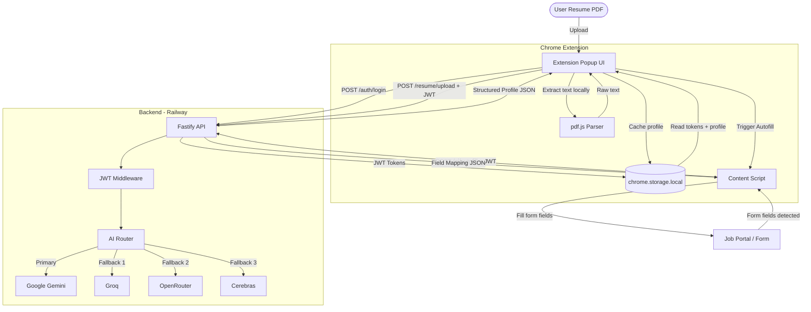

# ApplyOnce AI — Secure AI-Powered Universal Application Autofill Engine

[](https://nodejs.org/)
[](https://developer.chrome.com/docs/extensions/)
[](https://fastify.dev/)
[-blueviolet.svg)](https://openrouter.ai/)
[](https://railway.app/)
[](https://applyonce-ai-pitchdesk.vercel.app/)

**Live Pitch Deck:** [ApplyOnce AI Pitch Deck](https://applyonce-ai-pitchdesk.vercel.app/)

ApplyOnce AI is a secure, privacy-first universal profile parsing and browser form-filling automation engine. The platform combines in-browser PDF parsing, a hardened Node.js/Fastify backend with JWT authentication, and a multi-provider AI router to construct structure-validated candidate profiles — enabling seamless autofill workflows across any online application portal.

---

## The Problem We Solve

Job seekers spend hours manually typing the same repetitive information into job application portals (Workable, Greenhouse, Lever, Ashby, BambooHR, etc.). Rigid legacy autofill tools rely on brittle element ID matching, resulting in incomplete fields, broken UI mappings, and leaked data.

**ApplyOnce AI resolves this by:**
1. **Secure Resume Parsing**: Uploading PDF resumes to a dedicated backend, which parses and semantically extracts structured candidate data via an AI provider — with no raw API keys ever exposed to the browser.
2. **Context-Aware Semantic Autofill**: Translating page-level inputs, dropdowns, textareas, checkboxes, and radio buttons into a structured field mapping using the backend multi-provider AI router.
3. **Controlled Event Dispatching**: Triggering programmatic DOM inputs (`input`, `change`, `blur`) directly on the webpage, ensuring form state updates synchronize correctly with modern UI frameworks like React, Angular, and Vue.

---

## Architectural Overview

ApplyOnce AI uses a **secure backend-first architecture**. The Chrome extension communicates exclusively with the ApplyOnce backend over HTTPS using short-lived JWT access tokens. All AI provider API keys are stored server-side only — **never in the browser or extension bundle**.



---

## Key Features

- **Secure Backend Architecture**: All AI provider API keys are stored exclusively on the server. The extension holds only short-lived JWT tokens — no raw secrets ever reach the browser.
- **Multi-Provider AI Router**: Automatically routes to the best available AI provider (Gemini → Groq → OpenRouter → Cerebras) with automatic fallback, ensuring maximum uptime.
- **JWT Authentication**: Full user authentication with short-lived access tokens (15m) and rotating refresh tokens (7d), protecting all API endpoints.
- **LLM-Powered Semantic Extraction**: Upload PDF CVs and the backend extracts structured profiles via AI — eliminating rigid resume templates.
- **Dynamic Field Mapping Engine**: Maps forms dynamically on any domain using label-matching, semantic pattern groupings, and ARIA attribute checks.
- **Form Event Simulation**: Simulates user keystrokes and change events natively in the DOM, guaranteeing compatibility with React, Angular, and Vue-controlled fields.
- **Export & Import Engine**: Back up and restore your locally cached profile data as JSON through the Settings dashboard.

---

## Repository Structure

```
applyonce-ai/
├── backend/                        # Node.js + Fastify Backend API
│   ├── src/
│   │   ├── config/
│   │   │   └── env.ts              # Environment variable validation (Zod)
│   │   ├── middleware/
│   │   │   ├── auth.ts             # JWT Bearer token verification
│   │   │   └── errorHandler.ts     # Global error handler
│   │   ├── routes/
│   │   │   ├── auth.ts             # POST /auth/login, /auth/register, /auth/refresh
│   │   │   ├── resume.ts           # POST /resume/upload, /resume/analyze
│   │   │   ├── ai.ts               # POST /ai/autofill
│   │   │   ├── jobs.ts             # Job tracking endpoints
│   │   │   └── user.ts             # GET /user/me
│   │   ├── services/
│   │   │   ├── aiRouter.ts         # Multi-provider AI routing with fallback
│   │   │   ├── jwtService.ts       # Token generation & verification
│   │   │   ├── prompts.ts          # LLM prompt templates
│   │   │   └── providers/
│   │   │       ├── gemini.ts       # Google Gemini provider
│   │   │       ├── groq.ts         # Groq provider
│   │   │       ├── openrouter.ts   # OpenRouter provider
│   │   │       ├── cerebras.ts     # Cerebras provider
│   │   │       └── types.ts        # Shared provider interface
│   │   └── index.ts                # Fastify server entry point
│   ├── .env.example                # Required environment variables (template)
│   ├── package.json
│   └── tsconfig.json
├── extension/                      # Chrome Extension (Manifest V3)
│   ├── manifest.json               # Extension metadata & permissions
│   ├── popup.html                  # Extension popup entry
│   ├── options.html                # Extension settings entry
│   ├── src/
│   │   ├── lib/
│   │   │   └── apiClient.ts        # Authenticated fetch wrapper (JWT)
│   │   ├── components/             # Premium UI components (Tailwind, Framer Motion)
│   │   ├── hooks/                  # useAutofill, useProfile hooks
│   │   ├── services/               # pdf.js parser, AI service
│   │   └── storage/                # chrome.storage.local handlers
│   ├── .env.example                # VITE_API_URL template
│   └── vite.config.ts              # Multi-entry extension bundler
├── src/                            # React Landing Page
├── public/
│   └── download/
│       └── applyonce-extension.zip # Pre-built extension for users
└── package.json                    # Root workspace configuration
```

---

## Installation & Setup

### Prerequisites
- Node.js v18+ and NPM

---

### 1. Backend Setup

```bash
cd backend
cp .env.example .env
# Fill in .env with your real values (JWT secrets, AI provider keys, etc.)
npm install
npm run dev       # Development — runs on port 3001
```

**Required environment variables** (see [`backend/.env.example`](backend/.env.example)):

| Variable | Description |
|---|---|
| `JWT_SECRET` | 64-char random hex — access token signing key |
| `JWT_REFRESH_SECRET` | 64-char random hex — refresh token signing key (must differ!) |
| `GOOGLE_API_KEY` | Google Gemini API key (primary AI provider) |
| `GROQ_API_KEY` | Groq API key (fallback) |
| `OPENROUTER_API_KEY` | OpenRouter API key (fallback) |
| `CEREBRAS_API_KEY` | Cerebras API key (fallback) |
| `ALLOWED_ORIGINS` | Comma-separated CORS origins (frontend URL + `chrome-extension://YOUR_ID`) |

> Generate JWT secrets:
> ```bash
> node -e "console.log(require('crypto').randomBytes(64).toString('hex'))"
> ```

---

### 2. Extension Setup

```bash
cd extension
cp .env.example .env
# Set VITE_API_URL to your deployed backend URL
npm install
npm run build
```

**Extension environment variable:**

```env
VITE_API_URL=https://your-backend.up.railway.app
```

This creates `extension/dist/` — the production-ready, packaged extension directory.

To re-package the ZIP for public distribution:
```powershell
Compress-Archive -Path "extension\dist\*" -DestinationPath "public\download\applyonce-extension.zip" -Force
```

---

### 3. Landing Page Setup

```bash
# From project root
npm install
npm run dev
```

---

## Chrome Extension Deployment

### Option A — Use the pre-built ZIP (recommended for users)

1. Download `applyonce-extension.zip` from the landing page.
2. Unzip the file to a local folder.
3. Open **Google Chrome** → `chrome://extensions/`
4. Enable **Developer mode** (toggle, top-right).
5. Click **Load unpacked** → select the unzipped folder.

### Option B — Build from source

1. Follow the Extension Setup steps above.
2. Load `extension/dist/` as an unpacked extension in `chrome://extensions/`.

---

## Deployment

### Backend (Railway)

Deploy the `backend/` directory to Railway. Set all environment variables from `backend/.env.example` in the Railway project dashboard.

### Frontend (Lovable)

Push to the connected branch — Lovable auto-deploys the landing page. The `public/download/applyonce-extension.zip` file is served as a static asset for the download buttons on the landing page.

---

## Security Posture & Privacy Compliance

- **No API Keys in Browser**: All AI provider keys live exclusively on the backend server. The extension only stores JWT tokens in `chrome.storage.local`.
- **JWT with Short Expiry**: Access tokens expire in 15 minutes. Refresh tokens rotate automatically, limiting exposure from token theft.
- **CORS Allowlist**: Backend only accepts requests from explicitly configured origins (your frontend URL and extension ID).
- **No PII on Server**: Personal profile data is cached locally in `chrome.storage.local`. The backend processes data transiently for AI inference but does not persist raw PII.
- **TLS-only**: All extension ↔ backend traffic uses HTTPS.
- **Rate Limiting**: Built-in request rate limiting on all API endpoints to prevent abuse.
